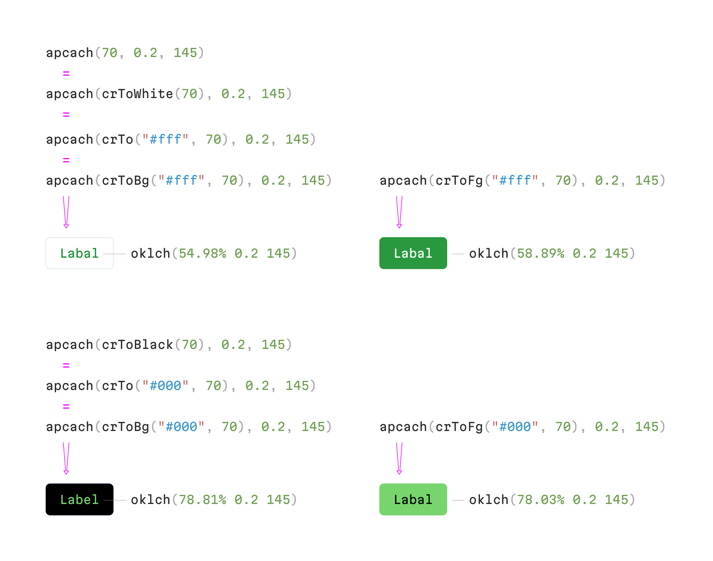

# apcach()

JS color calculator for composing colors with consistent APCA contrast ratio.


## Install

```bash
npm install apcach
```

## API



### Color on a white background

For composing a color you are going to use as a foreground color (for text or icons) on white background, use a short notation:

```js
import { apcach } from "apcach";
apcach(60, 0.2, 145); // oklch(62.01% 0.2 145)
```

Parameters are:

- desired contrast ratio (the same with APCA 0...108)
- chroma (the same with oklch 0...0.37)
- hue (the same with oklch 0...360)

### Color on a black background

For composing a forground color on black background, use `crToBlack()` function:

```js
import { apcach, crToBlack } from "apcach";
apcach(crToBlack(60), 0.2, 145); // oklch(73.14 0.2 145)
```

### Color on a custom background

For custom composing a foreground color on a custom hackground, use `crToBg()` function:

```js
import { apcach, crToBg } from "apcach";
apcach(crToBg("#E8E8E8", 60), 0.2, 145); // oklch(52.25% 0.2 145)
```

Parameters in `crToBg()` function are:

- background color (opaque colors only in one of these formats: `oklch`, `oklab`, `lch`, `lab`, `hex`, `rgb`, `hsl`, `p3`)
- desired contrast ratio (the same with APCA 0...108)

### Background color

APCA calculates contrast differently depanding on color position – on the background or in the foreground. So if you want to compose a color and use in on background, use `crToFg()` function:

```js
import { apcach, crToFg } from "apcach";
apcach(crToFg("white", 60), 0.2, 145); // oklch(65.53% 0.2 145)
```

Parameters in `crToFg()` function are:

- foreground color (opaque colors only in one of these formats: `oklch`, `oklab`, `lch`, `lab`, `hex`, `rgb`, `hsl`, `p3`)
- desired contrast ratio (the same with APCA 0...108)

### Maximum chroma

Use `maxChroma()` function insted of a static value for finding the most saturated color with given hue and contrast ratio:

```js
import { apcach, maxChroma } from "apcach";
apcach(crToFg("white", 60), maxChroma(), 145); // oklch(64.35% 0.27 145)
```

The `maxChroma()` accepts a value for limiting the highest possible value:

```js
import { apcach, maxChroma } from "apcach";
apcach(crToFg("white", 60), maxChroma(0.25), 145); // oklch(64.35% 0.25 145)
apcach(crToFg("white", 60), maxChroma(0.25), 200); // oklch(65.71% 0.15 200)
```

### Color manipulations

Having a color in apcach format, you can adjust its contrast, chroma or hue by using these functions:

```js
import { apcach, adjustContrast } from "apcach";
let color = apcach(60, 0.2, 145); // oklch(62.01% 0.2 145)
adjustContrast(color, 10); // oklch(54.98% 0.2 145)
```

Parameters in `adjustContrast()` function are:

- color you want to adjust
- contrast difference

```js
import { apcach, adjustChroma } from "apcach";
let color = apcach(60, 0.2, 145); // oklch(62.01% 0.2 145)
adjustChroma(color, -0.1); // oklch(63.38% 0.1 145)
```

Parameters in `adjustChroma()` function are:

- color you want to adjust
- chroma difference

```js
import { apcach, adjustHue } from "apcach";
let color = apcach(60, 0.2, 145); // oklch(62.01% 0.2 145)
adjustHue(color, 155); // oklch(67.29% 0.2 300)
```

Parameters in `adjustHue()` function are:

- color you want to adjust
- hue difference

### apcach color convertation to CSS

Once the color is composed, convert it into one of the CSS formats and use as usial

```js
import { apcach, apcachToCss } from "apcach";
let color = apcach(60, 0.2, 145);
apcachToCss(color, "oklch"); // oklch(62.01% 0.2 145)
apcachToCss(color, "hex"); // #00a22b
```

Parameters in `apcachToCss()` function are:

- color in apcach format you want to convert
- format (supported: `oklch`, `rgb`, `hex`)
